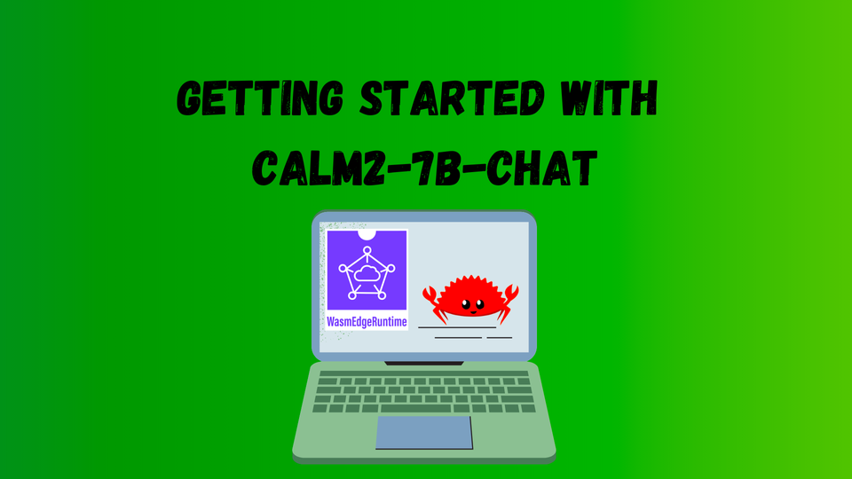

# CyberAgent製LLM(****CALM2-7B-Chat)の動作チュートリアル****

> [１つのコマンド](https://www.secondstate.io/run-llm/)を実行することで、より簡単に自分のデバイス上で、CALM2-7Bを動かすことができます。このコマンドは、自動でWasmEdge Runtime、モデルファイル、推論用のポータブルWasmアプリに関してダウンロードとインストールを行います。
> 

[CALM2-7B-Chat](https://huggingface.co/cyberagent/calm2-7b-chat)は、対話型ユースケースで利用を目的にCyberAgentLM2をファインチューニングしたモデルです。ベースモデルは、公開されている日本語と英語のデータセットの計1.3T tokenで事前学習されたデコーダー専用の大規模言語モデルです。日本のインターネット広告会社であるCyberAgentによってトレーニングされています。

この記事では、以下の部分に関して扱います。

- **自分のデバイス上で CALM2-7B-Chat を動かす方法**
- **CALM2-7B-Chat モデル用の OpenAI 互換 API サービスを作成**

Rust + Wasm を活用してこのモデルのアプリケーション開発を及び、デプロイを行います。

そのため、複雑なPythonパッケージやC++のツールチェーンをインストールから解放されます！

この技術スタックを採用する理由は[こちら](https://www.secondstate.io/articles/fast-llm-inference/)です。



## 自分のデバイス上でCALM2-7B-Chatを動かす方法

---

Step1: [WasmEdge](https://github.com/WasmEdge/WasmEdge)を以下のコマンドに従ってインストール

```bash
curl -sSf https://raw.githubusercontent.com/WasmEdge/WasmEdge/master/utils/install.sh | bash -s -- --plugin wasi_nn-ggml
```

Step 2: [CALM2-7B-ChatモデルのGGMLファイル](https://huggingface.co/second-state/Calm2-7B-Chat-GGUF)をダウンロード　モデルサイズが4.0GBあり多少時間がかかります。

```bash
curl -LO https://huggingface.co/second-state/Calm2-7B-Chat-GGUF/resolve/main/calm2-7b-chat.Q4_K_M.gguf
```

Step3:クロスプラットフォーム対応でポータブルなWasmファイルをダウンロード　このWasmアプリケーションは、ターミナル上でモデルとのチャットを可能とします。アプリのRustのソースコードは[こちら](https://github.com/second-state/llama-utils/tree/main/chat)です。

```bash
curl -LO https://github.com/second-state/llama-utils/raw/main/chat/llama-chat.wasm
```

環境の準備は完了です。ターミナル上で以下のコマンドを入力することで、モデルとチャットを開始できます。

```bash
wasmedge --dir .:. --nn-preload default:GGML:AUTO:calm2-7b-chat.Q4_K_M.gguf llama-chat.wasm -p vicuna-1.1-chat --stream-stdout
```

ポータブルなWasmアプリは、デバイスで利用可能なハードウェアアクセラレータ(GPUなど）を自動的に認識し利用します。

例えば、Mac M1 32GBでは1秒当たり約30トークン(60文字程度)生成できます。

```bash
[You]: 
二日間の京都旅行計画

 
 京都は、日本の文化と歴史を体験できる素晴らしい場所です。二日間の京都旅行を計画してみましょう。

一日目：
1. 京都に到着したら、まずは京都タワーに向かいましょう。京都タワーの展望台からは、京都の街並みを一望できます。
2. その後、京都御苑を散策しましょう。京都御苑は、京都の中心地にあり、美しい庭園や自然を楽しむことができます。
3. 昼食は、京都の伝統的な料理である京料理を楽しみましょう。おすすめは、京都の有名な料亭「菊乃井」です。
4. その後、京都国立博物館を訪れ、日本の伝統芸能である能や歌舞伎の展示を楽しみましょう。
5. 夕食は、祇園の街で、京都の伝統的な料理である精進料理を楽しみましょう。

二日目：
1. 京都の朝を散策しましょう。京都の朝はとても静かで、美しい庭園や神社仏閣を楽しむことができます。
2. 朝食は、京都の伝統的な料理であるおばんざいを楽しみましょう。おすすめは、京都の有名な朝食レストラン「朝食喜心」です。
3. その後、京都の有名な観光地、清水寺を訪れましょう。清水寺は、京都の街を一望できる絶景スポットです。
4. 昼食は、京都の有名なラーメン店「新福菜館」でラーメンを食べましょう。
5. 最後に、京都駅に戻り、新幹線や電車で帰宅しましょう。
```

## **CALM2-7B-Chat モデル用の OpenAI 互換 API サービスを作成**

---

OpenAI 互換 API サービスにより、LLMツールの大規模エコシステムやflows.network、LangChain、LlamaIndex などのエージェント フレームワークと連携することがでます。

APIサーバアプリをダウンロードします。これは多様なCPUおよびGPUデバイス上で実行可能なクロスプラットフォームなWasmアプリです。

```bash
curl -LO https://github.com/second-state/llama-utils/raw/main/api-server/llama-api-server.wasm
```

合わせてchatbotのWeb UIをダウンロードします。

```bash
curl -LO https://github.com/second-state/chatbot-ui/releases/download/v0.1.0/chatbot-ui.tar.gz
tar xzf chatbot-ui.tar.gz
rm chatbot-ui.tar.gz
```

次に、以下のコマンドでモデルのAPIサーバを起動します。起動後、ブラウザで[http://localhost:8080](http://localhost:8080/)にアクセスし、チャットを開始します。

```bash
wasmedge --dir .:. --nn-preload default:GGML:AUTO:calm2-7b-chat.Q4_K_M.gguf llama-api-server.wasm -p vicuna-1.1-chat
```

別のターミナルからcurlコマンドを使用してAPIサーバーと対話することもできます。

```bash
curl -X POST http://localhost:8080/v1/chat/completions \
    -H 'accept:application/json' \
    -H 'Content-Type: application/json' \
    -d '{"messages":[{"role":"system", "content": "You are a helpful assistant."}, {"role":"user", "content": "二日間の京都旅行計画"}], "model":"CALM2-7B-Chat"}'
```

以上で全てです。WasmEdge は、[LLMアプリケーションを実行する最も簡単で、最速かつ安全な方法](https://www.secondstate.io/articles/fast-llm-inference/)です。ぜひ試してみてください。

## 耳寄りな情報(Fun Fact)

---

WasmEdgeは、12月11日~12日に開催されたCloud Native Days Tokyoの基調講演で[”Wasm is becoming the runtime for LLMs”](https://event.cloudnativedays.jp/cndt2023/talks/2072)という題目で講演を行いました。

この講演では、Pythonの計算機的な限界を取り上げ、人気のあるLLMフレームワークがPython依存をゼロにする方向にシフトしていること、AGIのためのWasmの可能性について議論しました。

続く講演で、CyberAgentのエンジニアが新たに学習した言語モデルCALM2について話しました。このモデルの性能はとても素晴らしく日本語のどんな質問にも対応できるモデルでした。
そこでWasmEdgeは、開発者の間で好評を博している[日本製のLLM、CALM2-7B-ChatをMacで動作させるデモ](https://twitter.com/realwasmedge/status/1734484058212897000)を実施しました。

## **何かあれば相談ください！(Talk to us!)**

---

[Wasmedge Discord](https://discord.com/invite/U4B5sFTkFc)に参加して、質問や知見を共有してください。このモデルを実行する上で何か質問があれば、[Second-state/llama-utils](https://github.com/second-state/llama-utils/)にアクセスしてissueを立てるか、[Demoの予約](https://code.flows.network/webhook/vvAtEBUk6QMhVVLuw7IU)してください。デバイス上で独自のLLMをお楽しみください！

翻訳 [ishimotti](https://twitter.com/white_n_39)
